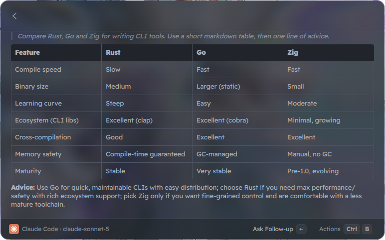
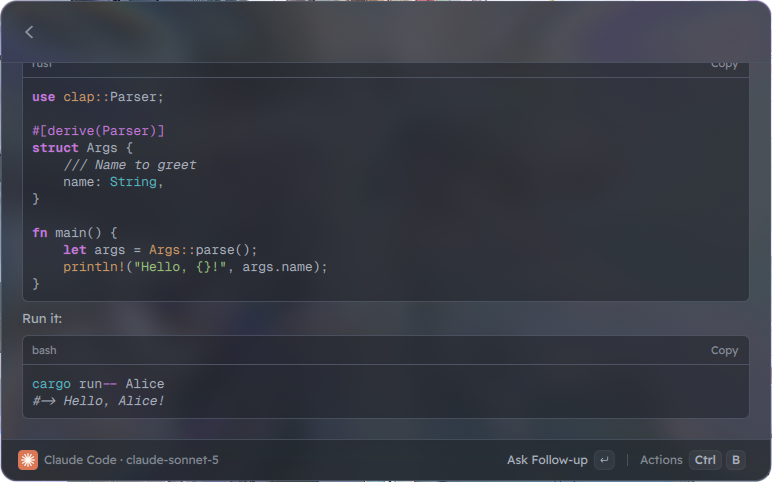
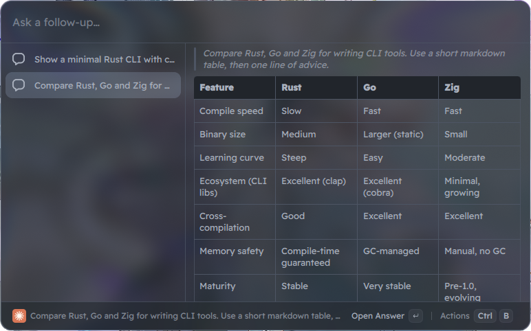
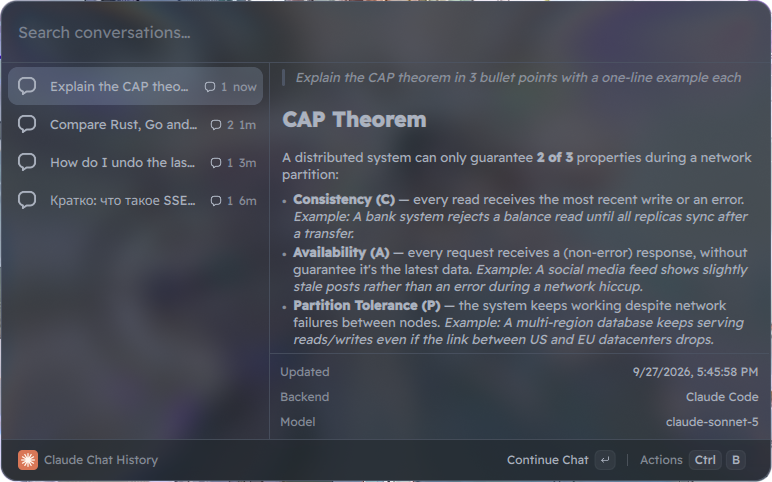

<div align="center">
  
  <h1>Claude Quick AI for Vicinae</h1>
  <p>Ask Claude from the <a href="https://vicinae.com">Vicinae</a> root search and read the answer as it streams in.<br>
  A Linux take on Raycast Quick AI. Runs on your Claude subscription through Claude Code, or on an API key.</p>

  <a href="https://github.com/zxsleebu/vicinae-claude/actions/workflows/ci.yml"></a>
  
  
</div>

<br>

<p align="center">
  
</p>

## What it does

Type `ask`, press <kbd>Tab</kbd>, write the question, press <kbd>Enter</kbd>. The answer streams into a Markdown view. Press <kbd>Enter</kbd> again to go back and ask a follow-up in the same chat.

- **Two backends.** `claude -p` from Claude Code uses the subscription you already pay for, no API key. The Anthropic Messages API works with a key or with any compatible proxy (CLIProxyAPI and similar) through a custom base URL.
- **Follow-ups.** The CLI backend resumes the same Claude Code session with `--resume`. The API backend sends the whole history.
- **Chat history.** Every conversation is saved locally. Open one to read it, continue it or delete it.
- **Fallback command.** Enable it once, and any root search with no good match can go straight to Claude.
- **Copy or paste the answer** into the window you came from, copy the whole conversation, stop a long answer halfway.

<table>
  <tr>
    <td></td>
    <td></td>
  </tr>
  <tr>
    <td align="center">Code blocks with copy buttons</td>
    <td align="center">The chat. The search bar is the follow-up input</td>
  </tr>
</table>

<p align="center">
  
  <br><sub>Chat History</sub>
</p>

## Install

You need [Vicinae](https://docs.vicinae.com), Node.js 20+, and for the default backend a logged-in [Claude Code](https://docs.claude.com/en/docs/claude-code) (`claude` should work in a terminal).

```bash
git clone https://github.com/zxsleebu/vicinae-claude.git
cd vicinae-claude
npm install
npm run build
```

`npm run build` runs `vici build`, which installs the extension into `~/.local/share/vicinae/extensions/claude-quick-ai`. The commands show up in Vicinae right away.

To use it as a fallback, open **Manage Fallback Commands** in Vicinae and enable **Ask Claude**.

### Faster ways in

- **Tab from an empty launcher.** Put **Ask Claude** first in your favorites. Vicinae selects it as soon as the window opens, so <kbd>Tab</kbd> jumps into the question field. Type, press <kbd>Enter</kbd>. This needs compact mode off, since compact mode hides the list until you type.
- **Alias + Space.** Set an alias such as `ai` on Ask Claude (Actions → Set Alias). Then `ai` <kbd>Space</kbd> jumps to the question field. Keywords alone don't do this, only an exact alias match does.
- **Global hotkey.** Give Ask Claude a hotkey in Vicinae's extension settings to open the chat from anywhere.

## Settings

Open them from any action panel with **Open Extension Preferences**.

| Setting | Default | Notes |
| --- | --- | --- |
| Backend | Claude Code CLI | `Claude Code CLI` or `Anthropic API` |
| Model | Claude Sonnet 5 | Sonnet 5, Opus 5.5 or Haiku 4.5. Both backends use it |
| Custom Model | | Any model id. Overrides the dropdown |
| System Prompt | | For the CLI, an empty value means a short built-in chat prompt instead of the Claude Code agent prompt |
| API Key | | API backend. Optional when a proxy needs no auth |
| Base URL | `https://api.anthropic.com` | Point it at a proxy, e.g. `http://127.0.0.1:8317`. With or without `/v1` |
| Max Tokens | `4096` | API backend |
| Claude Binary | | Empty means search `PATH`, `~/.local/bin`, `~/.claude/local` and a few more |

## Shortcuts

| Action | Keys |
| --- | --- |
| Ask / Ask follow-up | <kbd>Enter</kbd> |
| Copy answer | <kbd>Ctrl</kbd> <kbd>Shift</kbd> <kbd>C</kbd> |
| Paste answer into the active window | <kbd>Ctrl</kbd> <kbd>Shift</kbd> <kbd>V</kbd> |
| Copy question | <kbd>Ctrl</kbd> <kbd>Shift</kbd> <kbd>Q</kbd> |
| Copy conversation | <kbd>Ctrl</kbd> <kbd>Shift</kbd> <kbd>A</kbd> |
| New chat | <kbd>Ctrl</kbd> <kbd>N</kbd> |
| Stop generating | <kbd>Ctrl</kbd> <kbd>.</kbd> |

## How the CLI backend works

Each question starts one process:

```bash
claude -p --output-format stream-json --verbose --include-partial-messages \
  --tools "" --strict-mcp-config --setting-sources "" \
  --model <model> --system-prompt <prompt> [--resume <session_id>]
```

The prompt goes in on stdin. `--tools ""` turns off every tool, so Claude only chats and never touches files. `--strict-mcp-config` and `--setting-sources ""` skip your MCP servers and hooks, which keeps startup fast.

The extension reads stdout line by line. Text comes from `stream_event` → `content_block_delta` → `text_delta`. The session id comes from `system/init` or the final `result`, and an error shows up as a `result` with `is_error: true`.

Sessions live in the extension's support directory, so they stay out of your `~/.claude/projects` list. If a session is gone (Claude Code cleaned it up, or you switched backends mid-chat), the next follow-up sends the conversation as a transcript and carries on.

## Development

```bash
npm run dev        # vici develop, hot reload inside Vicinae
npm run typecheck
npm run lint       # vici lint, validates the manifest
npm test           # bun test
```

The tests run the API backend against a local fake SSE server. The CLI tests call the real `claude` with Haiku, and they skip themselves when `claude` is missing or `CI` is set.

```
src/
  ask-claude.tsx        "Ask Claude" command
  chat-history.tsx      "Claude Chat History" command
  components/ChatView   chat list + streaming answer view
  lib/chat.ts           streamChat(messages, onDelta, signal), picks the backend
  lib/api-backend.ts    Messages API over fetch + SSE
  lib/cli-backend.ts    claude -p stream-json
  lib/session.ts        conversation state that views subscribe to
  lib/storage.ts        LocalStorage, one key per conversation
```

## License

MIT
